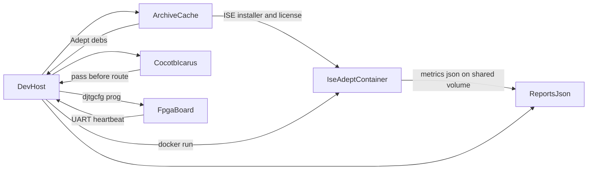

# FPGA Kits

Catalog, lessons, and a dev-host bring-up path for retired Digilent boards. The FPGAs are Spartan-3, Spartan-3E, and Spartan-6. The XC2-XL is a CoolRunner-II and XC9500XL CPLD board. The toolchain is Xilinx ISE WebPACK 14.7, which includes EDK for MicroBlaze and the CPLD fitter for the XC2-XL. Vivado does not support these families. USB programming of the FPGAs uses Digilent Adept 2 (`djtgcfg`), including onboard ports where they work. The preferred external JTAG cable is a [Bus Blaster v4.1a](docs/programmers/bus-blaster-v4.md) (`xc3sprog -c bbv2`): it is required for XC9500XL and is the one cable used for both CPLDs on the XC2-XL. A [JTAG-SMT2](docs/programmers/jtag-smt2.md) remains an Adept-compatible alternate on Digilent headers (`ADEPT_DEVICE=JtagSmt2`) but cannot target XC9500XL.

Vendor pages for these parts go stale. The archive caches manuals, photos, installers, and the built container image on this machine. Lessons explain the concepts and the math in this repo's own words and cite those cached files. They do not copy the manuals.

## Boards

| Board | Part | Bring-up |
| --- | --- | --- |
| [Nexys 3](docs/boards/nexys3.md) | Spartan-6 XC6SLX16-CS324 | Onboard Adept USB, `djtgcfg -d Nexys3 -i 0` |
| [Spartan-3E starter](docs/boards/spartan3e.md) | XC3S500E-4FG320 | Onboard USB JTAG, Hirose FX2 host for VDEC1 |
| [Spartan-3 starter](docs/boards/spartan3.md) | XC3S200-4FT256 | External Digilent JTAG cable and a USB-RS232 adapter |
| [VDEC1](docs/boards/vdec1.md) | ADV7183B video decoder | Daughtercard. The only host in this set is the Spartan-3E |
| [XC2-XL](docs/boards/xc2xl.md) | XC2C256-TQ144 and XC9572XL-VQ44 | 6-pin JTAG header. Bus Blaster on J1. Outside the FPGA stage order |
| [Breadboard 1](docs/boards/dbb1.md) | Passive 40-pin accessory (DBB1) | Plugs into the XC2-XL or Spartan-3 headers. No bitstream |
| [BSS138 shifter](docs/boards/bss138.md) | Adafruit 757, four BSS138 channels | 3.3 V XC2C256 side to 5 V TTL. No bitstream |

## Documentation

[docs/README.md](docs/README.md) is the index: board pages, the lesson list, the archive, the staged pipeline, and the report files.

## Lessons

Start at [docs/learn/README.md](docs/learn/README.md).

1. [Logic and LUTs](docs/learn/01-logic-and-luts.md)
2. [Clocks and timing math](docs/learn/02-clocks-and-timing.md)
3. [ISE operation](docs/learn/03-ise-operation.md)
4. [JTAG and configuration](docs/learn/04-jtag-and-configuration.md)
5. [UART](docs/learn/05-uart.md)
6. [Video and I2C](docs/learn/06-video-and-i2c.md)

Worked numbers use 50 MHz on the Spartan-3 and Spartan-3E, 100 MHz on the Nexys 3, and 27 MHz on the VDEC1.

## Archive

[archive/README.md](archive/README.md) describes the cache. Git tracks `archive/manifest.yaml`. The bytes live in `archive/cache/`, which is gitignored. `make archive` downloads public manuals and accepts an ISE tarball or Adept package dropped in place when the vendor requires an account. Proprietary installers stay on this machine.

## Pipeline

Simulation runs on the dev-host before place-and-route. The CentOS 6 container, matching Red Hat Enterprise Workstation 6 from the ISE 14.7 operating-system list, builds with ISE and writes timing JSON. `djtgcfg` programs over USB from the host Adept tree. The dev-host reads the UART.



Bring-up validates one target at a time. A stage writes `reports/<board>/stage.json`. The next stage does not run until that record is `pass`.

```bash
make archive
make stage BOARD=nexys3 STAGE=present
make stage BOARD=nexys3 STAGE=workflow
make stage BOARD=nexys3 STAGE=image
```

`present` and `workflow` do not place-and-route. `image` simulates, builds in the container, programs the primary path, and checks the UART. `make hil BOARD=nexys3` is that image stage. The Spartan-3E, Spartan-3, and VDEC1 commands stay closed until the Nexys image stage passes. Set `VDEC1_ATTACHED=1` before any VDEC1 stage. `HIL_SERIAL` is the host UART for the image stage.

Place-and-route is single-threaded and dominates the clock. While `par` runs, the dev-host writes `reports/<board>/<timestamp>/progress.json` with `elapsed_s`, the current phase, and `eta_s`. After `bitgen`, `scripts/parse_ise_reports.py` writes `build_metrics.json` from the `.srp`, `.par`, and `.twr` files. A non-zero timing score, or a setup or hold failure, stops the run before `djtgcfg`.

Cocotb and Icarus Verilog run the heartbeat checks in software. Verilator is an optional second simulator for the same tests. pytest writes JUnit XML and a JSON line per UART exchange (`host_monotonic_ns` and `fpga_cycles`).

Field names and an example of each file are in [docs/reports.md](docs/reports.md). The stage gates, the container, and the UART check are in [docs/pipeline.md](docs/pipeline.md).

ChipScope, Prometheus, and Grafana are not part of this bring-up. The JSON metrics and JUnit files are the records a later dashboard would scrape. ChipScope is an ISE internal-logic-analyzer bitstream for a later debug pass. It is not compiled into the heartbeat, and it does not fit the first design on the XC3S200.

## What you install on the dev-host

- Docker, so the ISE image can build and so the Adept helper container can see `/dev/bus/usb`
- Icarus Verilog (`iverilog`), Python 3, and a virtualenv with `pip install -r requirements.txt` (`cocotb`, `pytest`, `pyserial`, `PyYAML`). `make` uses `.venv/bin/python` when that directory exists.
- A USB-UART tty left on the host (`HIL_SERIAL=/dev/ttyUSB0`). `djtgcfg` programs the FPGA. Nothing in the container opens the serial node

The ISE 14.7 Linux tarball comes from your AMD account. Adept runtime and utilities `.deb` packages come from the [Adept 2 page](https://digilent.com/reference/software/adept/start). Put both in `archive/cache/sdk/` under the names in the manifest. `make image` fails with the manifest id when one of them is missing. After the image builds, `make archive-image` runs `docker save` into the cache.
