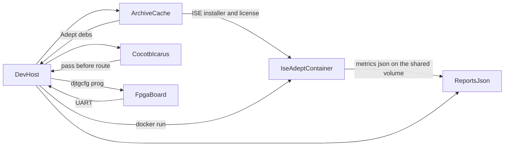

# Pipeline

The dev-host decides when a board is allowed to move. The CentOS 6 container runs ISE. `djtgcfg` runs from the host Adept tree, because Adept 2.27.9 needs a newer glibc than Red Hat Enterprise Workstation 6. The UART stays on the host.

## Make targets

| Target | What it does |
| --- | --- |
| `make archive` | Fetch public files in `archive/manifest.yaml` and refresh `archive/cache/status.json` |
| `make image` | Require the SDK rows, then `docker build` the `xilinx-ise-hil` image |
| `make archive-image` | `docker save` that image into `archive/cache/images/` |
| `make sim BOARD=<id>` | Cocotb on the dev-host. `vdec1` simulates the I2C probe. Every other id simulates the heartbeat |
| `make stage BOARD=<id> STAGE=<name>` | One of `present`, `workflow`, `image` |
| `make build BOARD=<id>` | ISE through `bitgen` and the timing check. Does not program |
| `make hil BOARD=<id>` | The `image` stage |
| `make check` | pytest, then `make sim` for `nexys3` and `vdec1` |

`BOARD` defaults to `nexys3`. `STAGE` defaults to `present`.

## Stages

A stage writes `reports/<board>/stage.json`. The next stage on that board does not run until the previous record is `status: pass`.

| Stage | Evidence | Does not |
| --- | --- | --- |
| `present` | `djtgcfg enum` and `djtgcfg init` show the expected IDCODE at the programmed index | Place-and-route, or open the UART |
| `workflow` | The same chain still answers, and `HIL_SERIAL` is recorded when it is set | Place-and-route |
| `image` | Simulation passed, timing score is 0, `djtgcfg prog` returned 0, and the UART line arrived | Write Platform Flash or PCM |

`present` on the VDEC1 does not scan JTAG. It records that `VDEC1_ATTACHED=1` is set and that the Spartan-3E `present` stage already passed. The ACK line is the image stage.

Board order is fixed: `nexys3`, then `spartan3e`, then `spartan3`, then `vdec1`. Any stage on a later board is refused until `reports/nexys3/stage.json` shows `image` as `pass`. A VDEC1 stage also waits for the Spartan-3E `present` stage. The XC2-XL is cataloged and archived, and `make stage` does not accept `BOARD=xc2xl`. Its configuration image is a JEDEC file on 6-pin header J1. Prefer the [Bus Blaster v4.1a](programmers/bus-blaster-v4.md) and `xc3sprog -c bbv2` for both CPLDs; that cable is required for the XC9572XL. The Breadboard 1 is a passive accessory on the XC2-XL or Spartan-3 headers, and `make stage` does not accept `BOARD=dbb1`. The BSS138 level shifter is the 3.3 V to 5 V TTL adapter on the XC2-XL UART, and `make stage` does not accept `BOARD=bss138`.

The Spartan-3E can pass `present` on the onboard Xilinx USB device (`vendor 03fd` in `lsusb`) when Adept does not see a cable. That path is recorded as `jtag-onboard-xilinx`. The image stage still refuses it, because programming uses `djtgcfg` and does not drive that programmer. Plug in a Digilent cable, or use the onboard USB only if Adept enumerates it, and rerun `present`.

## What the image stage runs

`scripts/stage.py` calls `scripts/flow.py`, then `djtgcfg prog`, then `scripts/hil.py`.

1. Cocotb must pass. The heartbeat suites use the Nexys 3 sim target. The VDEC1 suite uses `BOARD=vdec1`. A failure stops the run before Docker starts.
2. The container runs `scripts/ise_build.sh`: `xst`, `ngdbuild`, `map`, `par`, `bitgen`. `map` and `par` are wrapped with `time -p`.
3. The host tails `PHASE` lines, rewrites `progress.json`, and prints one status line to the terminal when the phase changes and again every few seconds. Seeds live in `boards/<id>.yaml` under `phase_seeds_s`. After the first successful run, each phase median comes from earlier `progress.json` files. Programming and the UART check print their own lines before the stage JSON.
4. `scripts/parse_ise_reports.py` writes `build_metrics.json`. A timing score other than 0, or a setup or hold failure in a `.twr` that happens to be in the run directory, exits before `djtgcfg`.
5. `djtgcfg prog -d <device> -i <index> -f project.bit` runs from the host Adept tree, in a privileged container with `/dev/bus/usb` mounted when `djtgcfg` is not on `PATH`. The device name is the one `present` recorded. `ADEPT_DEVICE` selects a different programmer, including the [JTAG-SMT2](programmers/jtag-smt2.md) (`JtagSmt2`) on a board JTAG header.
6. The host opens `HIL_SERIAL` at the board baud (115200). A heartbeat must produce `HELLO,<name>` and then answer `PING` with `PONG` and a cycle count that did not go backwards. The VDEC1 must produce a line starting with `VDEC1,ACK`.

`make build` is steps 1 through 4. It still requires a passing `workflow` stage.

## Container

`docker/ise/Dockerfile` is CentOS 6, the rebuild of Red Hat Enterprise Workstation 6. [UG631](https://docs.amd.com/v/u/en-US/irn) lists that release, Red Hat Enterprise Workstation 5, and SUSE Linux Enterprise 11 as the Linux systems ISE 14.7 supports. That file is the OS base. `make image` runs `scripts/ise_vnc_image.sh`, which installs ISE WebPACK 14.7 from `archive/cache/sdk/Xilinx_ISE_DS_Lin_14.7_1015_1.tar` into `/opt/Xilinx` with cable drivers left off. The installer pages the license in a terminal, so that step runs once in a browser at `http://127.0.0.1:6080/vnc.html`. `gmake` is a symlink to `/usr/bin/make`. ISE's bundled `libstdc++.so` is left in place.

Adept runtime 2.27.9 needs glibc 2.23 or newer. RHEL 6 has glibc 2.12, so the image does not install those debs. `djtgcfg` runs from the extracted Adept tree on the host. On a successful install the script copies `archive/cache/sdk/Xilinx.lic` to `/root/.Xilinx/Xilinx.lic` inside the image. The entrypoint also exports a `.lic` mounted at `$HOME/.Xilinx`.

The entrypoint clears `LANG` and `QT_PLUGIN_PATH`, sources `/opt/Xilinx/14.7/ISE_DS/settings64.sh`, then puts `/usr/lib64`, `/lib64`, `/usr/lib`, and `/lib` ahead of the paths that script added.

Synthesis mounts the repo at `/work`. The ISE container does not receive the USB bus. The committed image contains the WebPACK license, so `docker save` stays in `archive/cache/images/` for machines here. It is not pushed to a public registry.

`make image` stops when the tarball or the Adept debs are missing from `archive/cache/sdk/`. If `xilinx-ise-hil` is already present it leaves that image alone.

`FPGA_KIT_SKIP_DOCKER=1` makes `build_board` return after writing the run directory. Tests use it. A real image stage leaves it unset.

## Environment

| Variable | When |
| --- | --- |
| `HIL_SERIAL` | Host tty for the image stage. Example: `/dev/ttyUSB0`. Required for `image`. `workflow` records whether it opens |
| `VDEC1_ATTACHED` | Must be `1` before any VDEC1 stage. Attach the card only when the probe bitstream is the one that will be loaded |
| `ADEPT_DEVICE` | Adept name from `djtgcfg enum`, when it is not the YAML default. `JtagSmt2` selects the JTAG-SMT2 |
| `FPGA_KIT_SKIP_DOCKER` | Set to `1` to skip the container. Not for a board run |

## Dev-host packages

Docker, so the ISE image can build and so the Adept helper container can see the USB bus. Icarus Verilog (`iverilog`), Python 3, and `pip install -r requirements.txt` (`cocotb`, `pytest`, `pyserial`, `PyYAML`). `make` uses `.venv/bin/python` when that directory exists. The ISE tarball and the Adept packages are not installed as host packages. They go in the cache, as [archive/README.md](../archive/README.md) describes.
